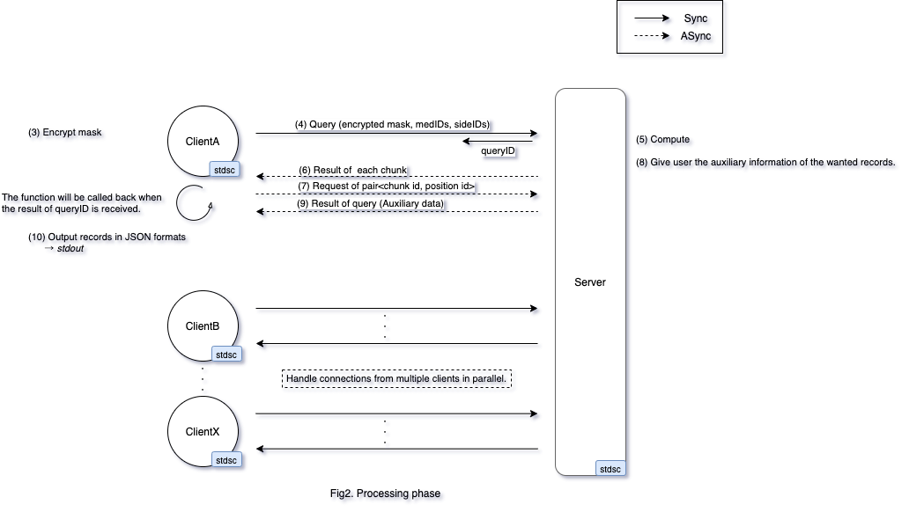

# Secure Side Effect Search

## Requirement
- GCC (7.4.0)
- CMake (>=3.10)
- HElib (revision: 8c43c402796495081f83baea49143daa8583371d)
  - https://github.com/homenc/HElib.git
- Boost (Use `boost::algorithm`)
- GMP (6.1.2)
- NTL (11.3.2)
- Docker (19.03.13) 

## Build
You can build by executing the following commands:

```
$ bash build_docker.sh
```

following files generated.

| File | Content |
|:---|:---|
| `build/sses/sses_client/libsses_client.so` | Client library |
| `build/sses/sses_server/libsses_server.so` | Server library |
| `build/sses/sses_share/libsses_share.so` | Shared library |
| `build/stdsc/stdsc/libstdsc.so` | stdsc library (see: stdsc/README.md) |
| `build/demo/client/client` | Client demo app |
| `build/demo/server/server` | Server demo app |

## Run

1. Start docker container
```
$ bash run_container.sh start
```
2. Allow to make connections to the X server from docker
```
$ xhost local:
```
3. Run demo app on docker
```
$ docker exec -it sses bash
[root@xxxxxxxx]# bash demo.sh
```
4. Stop docker container
```
$ bash run_container.sh stop
```

## Demo App
The demo app consists of two processes, `Client` and `Server`. These processes communicate as shown in the following figure.

### Setup Phase


### Processing Phase



### Client
* Usage
    ```sh
    client [-h] [-i IP Address] [-p PORT] [-c ContextSetting] [-k FHE key ID] age gender list-of-query-medicines query-side-effects

    positional arguments:
      age                       Age
      gender                    Gender (m:f:o)
      list-of-query-medicines   List of query medicines
      query-side-effects        Query side effects

    optional arguments:
      -h                        Show this help
      -i <IP Address>           IP Address (default: 127.0.0.1)
      -p <PORT>                 PORT (default: 80)
      -c <ContextSetting>       FHE context setting file
      -k <FHE key ID>           FHE key ID
    ```

* How it works?
    * Try to connect to `[IP Address]:[PORT]`.
    * Receive [age] [gender] [number of query medicine] [List of query medicines] [number of query side effects] [List of query side effects] from user.
    * Generates FHE context and keys. (Fig1. (1))
    * Send FHE context and public key to Server. (Fig. (2))
    * Encrypted [age] [gender] into [(Encrypted) query mask]. (Fig2. (3))
    * Send [(Encrypted) query mask] [number of query medicine] [List of query medicines] [number of query side effects] [List of query side effects] to server. (Fig2. (4))
    * Receive the result of each chunk sent by server. (Fig2. (6))
    * Decrypt the result. find 0's inside, and tell server `pair<chunk id, position id>` is desired. (Fig2. (7))
    * Receive the auxiliary data from server and output to user. (Fig2. (9)(10))

### Server
* Usage
    ```sh
    server [-p PORT] [-q Max Queries] [-r Max Results] [-l Max Result Lifetime] [-t NThreads] [-d DB direcotry] [-f CSV filepath]
    
    positional arguments:

    optional arguments:
      -h                         Show this help
      -p <PORT>                  PORT (default: 80)
      -q <Max Queries>           Max number of queries the server will accept (default: 128)
      -r <Max Results>           Max number of results the server will hold (default: 128)
      -l <Max Result Lifetime>   Lifetime of results (sec) (default: 50000)
      -t <NTHreads>              Number of threads used for calculations per query (default: 28)
      -d <DB dDirectory>         The directory where the server stores the database files (default: .)
      -f <CSV filepath>          DB of medical records
    ```

* How it works?
    * Listen to PORT until a user replies.
    * Receive FHE context and public key. (Fig1. (2))
    * From the generated dummy data, initialize the inverted index med.inv and side.inv. (Fig1. (3'))
    * Generate Encrypted records from a plaintext record using encrypted [mask]. (Fig1. (3'))
    * Receive [(Encrypted) query mask] [number of query medicine] [List of query medicines] [number of query side effects] [List of query side effects] from client. (Fig2. (4))
    * Filter by `query medicines` and `query side effects` using **merge of inverted index**.
    * Split the filtered result into chunks of (100, 500, 1000, 2000), extract the ciphertext `mask` from files. Put them into slots. each chunk one `Ctxt`. Multithreading begins.
    * Subtract with [(Encrypted) query mask] got in step 2.
    * Broaden the range from `-5` to `+5`, get a `vector<Ctxt>` of 11 elements.
    * Use a pyramidal way to do `Π` (this step will greatly consume level): `11` -> `6` -> `3` -> `2` -> `1`
    * The result is timed with a random integer within `1 - 256`.
    * The result is returned back to the user, sepearted with chunks. (Fig2. (6))
    * Receive the user's reply of which record(s) the user want. (Fig2. (7))
    * Give user the auxiliary information of the wanted records. (Fig2. (8)(9))
* State Transition Diagram
    * 

# Documents

## API Reference
```
$ cd doc && doxygen
```
see `doc/html/index.html`

# Appendix

* auxdata
1. `0-39999.bin`: auxiliary information (non-query related information)
2. `med.inv` and `side.inv`: inverted index for the medicine and side effects
* encdata
1. `0-39999.bin`: encrypted mask for each records
* settings
1. `ctxt_<keyID>.bin`: FHE context
2. `pk_<keyID>.bin`: FHE public key
3. `sk_<keyID>.bin`: FHE secret key (Only live in Client side)
4. `contextsetting.txt`: Instruct how keygen set the parameters like `m`, `p`, `r`, `L`, etc.

# License
Copyright 2020 Yamana Laboratory, Waseda University
Supported by JST CREST Grant Number JPMJCR1503, Japan.

Licensed under the Apache License, Version 2.0 (the "License");
you may not use this file except in compliance with the License.
You may obtain a copy of the License at

http://www.apache.org/licenses/LICENSE-2.0

Unless required by applicable law or agreed to in writing, software
distributed under the License is distributed on an "AS IS" BASIS,
WITHOUT WARRANTIES OR CONDITIONS OF ANY KIND, either express or implied.
See the License for the specific language governing permissions and
limitations under the License.
